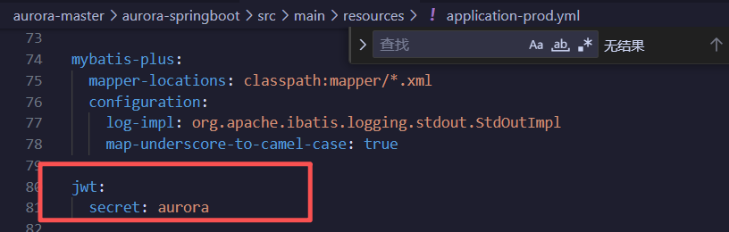
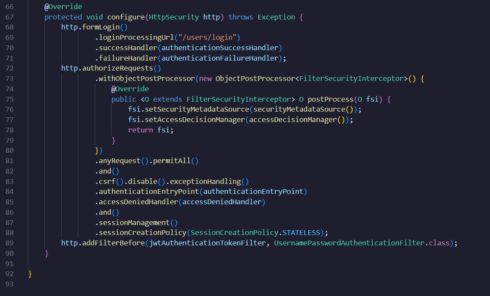
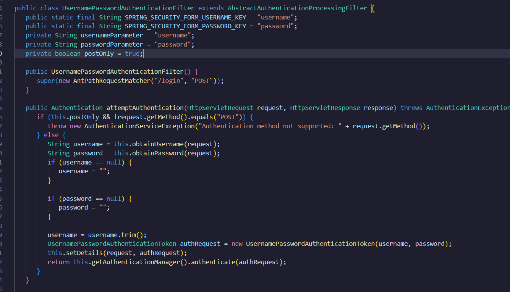
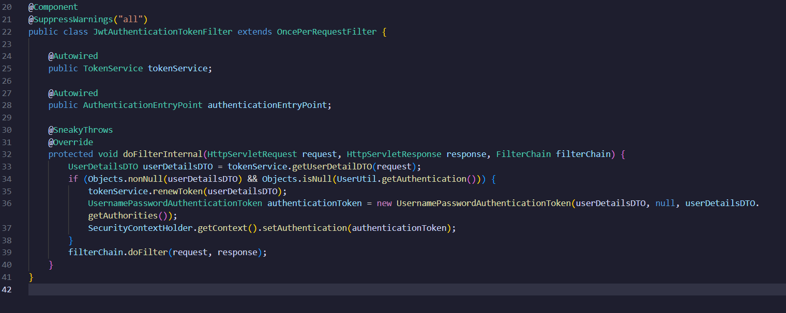
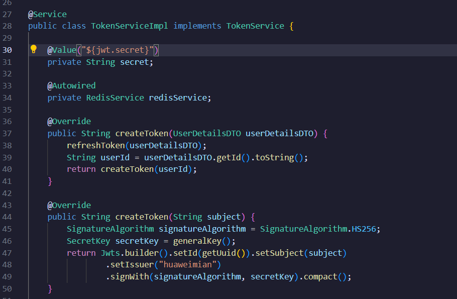
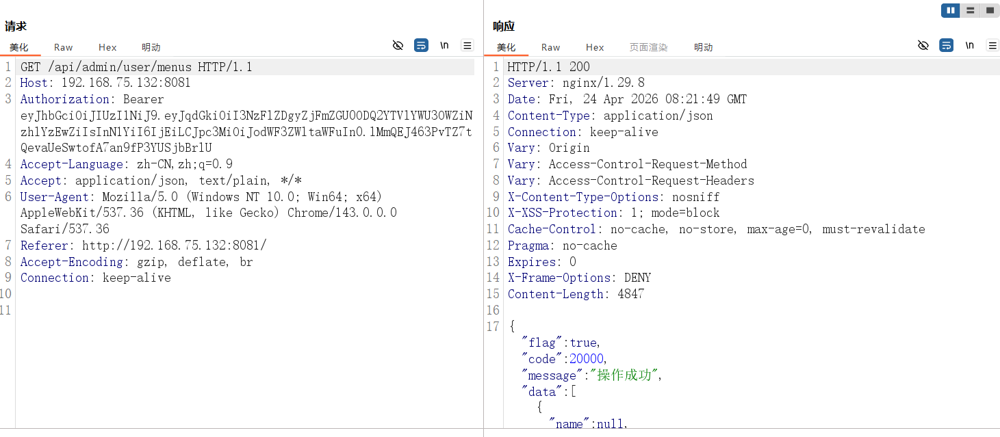
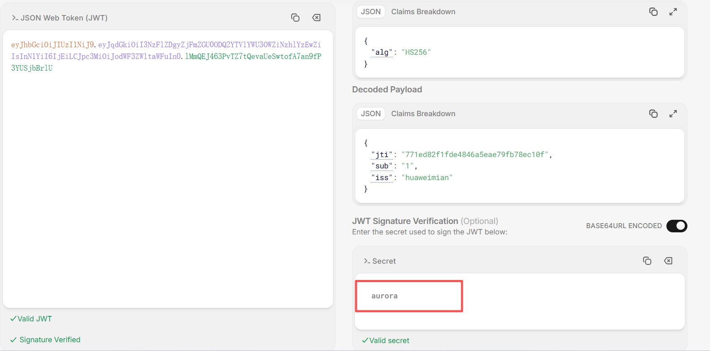

# Overview

Aurora Blog  is a personal blog system built on Spring Boot. In this 1.0 version, the secret key used for signing JSON Web Tokens (JWT) is cryptographically weak and hardcoded in plaintext within a configuration file. An attacker can exploit this weak key to forge a valid JWT token in a very short time, thereby bypassing the system’s authentication mechanism and potentially gaining administrator privileges.

# Vulnerability Analysis

**Details**：The JWT signing key is set to a simple 6‑letter string `"aurora"`. This key is hardcoded via the `jwt.secret`property in the configuration file `application-prod.yml`. Due to the extremely short length and low entropy of the key, and the use of the HS256 signing algorithm, an attacker can easily recover the key through offline brute‑force or dictionary attacks.

### Technical Principle and Call Chain 

1. **Key Configuration**: The root cause lies in `src/main/resources/application-prod.yml`, where the configuration item `jwt.secret: aurora`defines the JWT signing key.
2. **Key Reading and Token Generation**: In the `TokenServiceImpl`class, the `generalKey()`method reads the weak key from the above configuration file for subsequent JWT token generation and verification.
3. **Request Filtering and Verification**: The system uses the `JwtAuthenticationTokenFilter`to intercept all incoming requests. This filter invokes the token verification service. It is registered in the Spring Security configuration (`WebSecurityConfig`) and is placed before the username‑password authentication filter, ensuring that JWT verification is performed first on every request.
4. **Attack Path**: Once an attacker discovers or cracks the weak key, they can issue a legitimate JWT token containing arbitrary user identity information (e.g., an administrator identifier). When the system verifies such a forged token, the signature check will pass, causing the system to mistakenly accept it as valid, thereby completely subverting the authentication process.

Vulnerability class file: aurora-springboot\src\main\resources\application-prod.yml

class file: aurora-springboot\src\main\java\com\aurora\config\WebSecurityConfig.java

class file: aurora-springboot\src\main\java\com\aurora\filter\JwtAuthenticationTokenFilter.java

class file:aurora-springboot\src\main\java\com\aurora\service\impl\TokenServiceImpl.java

# Steps to Reproduce

1.Log into the system normally and obtain a valid JWT token from the `Authorization`header of an HTTP request.

2.Decode the token on a JWT decoding platform (e.g., jwt.io) to confirm its payload structure.In the JWT debugging tool, set the secret key for signature verification to the hardcoded weak key `aurora`.

